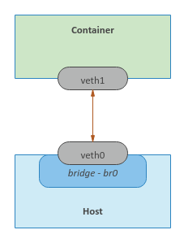

# Building a Linux Container using Namespace
`Sumit Yadav`

---

# Overview

Ever wondered how Linux Containers worked???

1. Docker is one of the most popular container implementations.
2. Containers share the same OS kernel but isolate application processes.
3. Key technology: Namespaces.

---

# Namespaces in Linux Containers

Namespaces abstract global system resources to create isolated instances for processes.

---

# Types of Namespaces

- **IPC Namespace**
  - Isolates interprocess communication resources: `Message Queues, Semaphores, and Shared Memory.`

- **Network Namespace**
  - Isolates networking resources: `Network devices, IP addresses, IP routing tables, /proc/net directory, and port numbers.`

- **Mount Namespace**
  - Isolates `filesystem mount points`, allowing different views of the filesystem hierarchy.

---

- **PID Namespace**
  - Isolates the `process ID number space`, enabling the same PID in different namespaces.

- **User Namespace**
  - `Isolates user and group ID number spaces`, allowing different user/group IDs inside and outside the namespace.

- **UTS Namespace**
  - Isolates system identifiers: `hostname and NIS domain name`, allowing each container to have its own.

---

# Installation and Setup

Every namespace is implemented using `unshare` Linux command as well as implement, build, and execute a simple container using `golang`.

---
# Container
How simple Container are created using different:-

---
## **unshare**

```bash
sudo unshare -u /bin/sh
```
```bash
-m, --mount[=<file>]      unshare mounts namespace
 -u, --uts[=<file>]        unshare UTS namespace (hostname etc)
 -i, --ipc[=<file>]        unshare System V IPC namespace
 -n, --net[=<file>]        unshare network namespace
 -p, --pid[=<file>]        unshare pid namespace
 -U, --user[=<file>]       unshare user namespace
 -C, --cgroup[=<file>]     unshare cgroup namespace
-f, --fork                fork before launching <program>
     --mount-proc[=<dir>]  mount proc filesystem first (implies --mount)
 -r, --map-root-user       map current user to root (implies --user)
     --propagation slave|shared|private|unchanged
 ```

---
## **golang**
```go
func execContainerShell() {
    log.Printf("Ready to exec container shell ...\n")

    if err := syscall.Sethostname([]byte("leopard")); err != nil {
       panic(err)
    }

    const sh = "/bin/sh"

    env := os.Environ()
    env = append(env, "PS1=-> ")

    if err := syscall.Exec(sh, []string{""}, env); err != nil {
        panic(err)
    }
}
```
---

# UTS Namespace

---

*Listing Namespaces:* Each process has associated namespaces listed in `/proc/[PID]/ns`. Running `ls -l /proc/$$/ns` shows symbolic links representing the namespaces of the current process.

---

*Isolating Hostname with UTS Namespace:* Using the command `sudo unshare -u /bin/sh` isolates the `hostname` in a new UTS namespace. Changes to the hostname in this namespace (e.g., hostname leopard) do not affect the parent namespace.

---

*Go Program for Namespace Isolation:* A Go program can mimic the unshare command to isolate the UTS namespace. The program uses `syscall.Sethostname` to set a new hostname and `syscall.Exec` to execute a shell in the new namespace. 

---
## Golang
```go
cmd.SysProcAttr = &syscall.SysProcAttr{
        Cloneflags: syscall.CLONE_NEWUTS,
    }
```
> Cloneflags: Specifies the namespaces to unshare (UTS)

---

# User Namespace

---

To launch a simple container whose *user/group* IDs as well as the *host name* are isolated from the parent namespace, execute the following command in Terminal.

```bash
sudo unshare -uU /bin/sh
>> uid=65534(nobody) gid=65534(nogroup) groups=65534(nogroup)
```
mapping for the user/group ID to the parent user/group ID
```bash
sudo unshare -uUr /bin/sh
>> uid=65534(root) gid=65534(root) groups=65534(root)
```
---
## Golang

```go
cmd.SysProcAttr = &syscall.SysProcAttr{
        Cloneflags: syscall.CLONE_NEWUTS | syscall.CLONE_NEWUSER,
        UidMappings: []syscall.SysProcIDMap{
            {ContainerID: 0, HostID: 0, Size: 1},
        },
        GidMappings: []syscall.SysProcIDMap{
            {ContainerID: 0, HostID: 0, Size: 1},
        },
    }
```

> Cloneflags: Specifies the namespaces to unshare (UTS and user).

> UidMappings and GidMappings: Maps the root user (ID 0) in the container to the root user on the host.

---

# PID Namespace
To launch a simple container whose process IDs as well as the user/group IDs and the host name are isolated from the parent namespace, execute the following command in Terminal.

---

```bash
sudo unshare -uUrpf --mount-proc /bin/sh
ps -fu
```
we see the isolation between the new namespace and the parent namespace.
```bash
USER       PID %CPU %MEM    VSZ   RSS TTY      STAT START   TIME COMMAND
root         1  0.0  0.0   4628   880 pts/1    S    09:08   0:00 /bin/sh
root         6  0.0  0.0  37368  3340 pts/1    R+   09:12   0:00 ps -fu
```
---
## Golang
```bash
cmd.SysProcAttr = &syscall.SysProcAttr{
        Cloneflags: syscall.CLONE_NEWUTS | syscall.CLONE_NEWUSER | syscall.CLONE_NEWNS | syscall.CLONE_NEWPID,
        UidMappings: []syscall.SysProcIDMap{
            {ContainerID: 0, HostID: 0, Size: 1},
        },
        GidMappings: []syscall.SysProcIDMap{
            {ContainerID: 0, HostID: 0, Size: 1},
        },
    }
```
> we specify the additional `syscall.CLONE_NEWNS` and `syscall.CLONE_NEWPID` OS attributes to indicate the command be run in a new PID namespace.

---
# Mount Namespace
To launch a simple container whose mount points as well as the process IDs, the user/group IDs, and the host name are isolated from the parent namespace, execute the following command in Terminal.

---
### Steps to Set Up and Isolate a Minimal Ubuntu Base Image Using Mount Namespace

1. **Prepare the Base Image**:
   - Create necessary directories: `mkdir -p /tmp/rootfs/.old_root`
   - Extract the Ubuntu base image: `tar -xvf $HOME/Downloads/ubuntu-base-18.04.4-base-amd64.tar.gz --directory /tmp/rootfs`
   - Navigate to `/tmp` directory.

---

2. **Isolate the Environment with Unshare**:
   - Launch a container with isolated UTS, User, PID, and Mount namespaces: `sudo unshare -uUrpfm --mount-proc /bin/sh`
   - This creates a new shell with the mentioned namespaces isolated from the parent.
---
3. **View and Compare Mount Points**:
   - In the parent namespace, list all mount points: `cat /proc/mounts | sort`
   - In the new namespace, list all mount points: `cat /proc/mounts | sort`
   - Compare the mount points to observe isolation.

---

4. **Modify the New Namespace**:
   - Make the root filesystem private: `mount --make-rprivate /`
   - Bind mount the root filesystem: `mount --rbind rootfs/ rootfs/`
   - Mount the proc filesystem: `mount -t proc proc rootfs/proc`
   - Change the root filesystem using pivot_root: `pivot_root rootfs/ rootfs/.old_root`
   - Change to the new root directory: `cd /`

---

5. **Validate Changes and Clean Up**:
   - Verify the isolated environment by creating and checking files in `/tmp`.
   - Mount `/tmp` as tmpfs: `mount -t tmpfs tmpfs /tmp`
   - Create a file in the new namespace: `echo 'leopard' > /tmp/leopard.txt`
   - List the file in both namespaces to confirm isolation.
   - Remove the parent root filesystem: `mount --make-rprivate /.old_root` and `umount -l /.old_root`
   - Exit the new namespace with `exit`.
---

This procedure effectively demonstrates creating a minimal isolated environment using Mount Namespace along with UTS, User, and PID namespaces.
```bash
cat /proc/mounts | sort
```
```bash
/dev/sda1 / ext4 rw,relatime,errors=remount-ro,data=ordered 0 0
proc /proc proc rw,relatime 0 0
tmpfs /tmp tmpfs rw,relatime 0 0
```
---
## Golang
The Go program creates a minimal container-like environment using various Linux namespaces and the `unshare` system call. 
what the code does:

1. **Initial Setup**:
   - The program starts by checking its arguments. If the argument `"CLONE"` is passed, it calls `execContainerShell`. Otherwise, it forks a new process with the necessary namespace flags.

---

2. **Creating Namespaces**:
   - A new process is forked with `CLONE_NEWUTS`, `CLONE_NEWUSER`, `CLONE_NEWNS`, and `CLONE_NEWPID` flags, isolating UTS, User, Mount, and PID namespaces.
   - User and group ID mappings are set to map the root user inside the container to the root user on the host.

---

3. **Executing in New Namespaces** (`execContainerShell` function):
   - Changes the hostname to `"leopard"`.
   - Changes the current directory to `/tmp`.
   - Makes the root filesystem private and recursively bind mounts the `rootfs/` directory.
   - Uses `pivot_root` to change the root filesystem to `rootfs/`, effectively isolating it from the parent filesystem.
   - Mounts a new `tmpfs` at `/tmp` and the `proc` filesystem at `/proc`.
   - Calls `createTxtFile` to create a file `/tmp/leopard.txt` with the content "leopard".
   - Makes `.old_root` private and unmounts it to finalize the filesystem isolation.
   - Replaces the current process with a new shell (`/bin/sh`) with a customized prompt.

---


4. **Main Function Workflow**:
   - Checks for the `"CLONE"` argument and decides whether to create namespaces or execute the container setup.
   - If namespaces are to be created, it sets up command attributes and runs a new instance of the program in the isolated namespaces.

---
# Network Namespace
To launch a simple container whose networking as well as the mount points, the process IDs, the user/group IDs, and the host name are isolated from the parent namespace, execute the following command in Terminal.

---
```bash
# Namespace Terminal
sudo unshare -uUrpfmn --mount-proc /bin/sh
ip link
ip link set dev lo up
ping 127.0.0.1 -c3

# Host Terminal
sudo brctl addbr br0
sudo brctl show
sudo ip addr add 172.20.1.2/24 dev br0
sudo ip link set br0 up
ip link
>>1: lo: <LOOPBACK,UP,LOWER_UP> mtu 65536 qdisc noqueue state UNKNOWN mode DEFAULT group default qlen 1000
    link/loopback 00:00:00:00:00:00 brd 00:00:00:00:00:00
>>2: enp5s0: <NO-CARRIER,BROADCAST,MULTICAST,UP> mtu 1500 qdisc fq_codel state DOWN mode DEFAULT group default qlen 1000
    link/ether 18:18:18:05:05:05 brd ff:ff:ff:ff:ff:ff
>>3: br0: <BROADCAST,MULTICAST,UP,LOWER_UP> mtu 1500 qdisc noqueue state UNKNOWN mode DEFAULT group default qlen 1000
    link/ether 0a:ae:d0:65:21:bb brd ff:ff:ff:ff:ff:ff
```

---


```bash
# Host Terminal
sudo ip link add veth0 type veth peer name veth1
export UPID=$(pidof unshare)
sudo ip link set veth1 netns $UPID
ip link
# Namespace Terminal
ip link
>>1: lo: <LOOPBACK,UP,LOWER_UP> mtu 65536 qdisc noqueue state UNKNOWN mode DEFAULT group default qlen 1000
    link/loopback 00:00:00:00:00:00 brd 00:00:00:00:00:00
>>2: veth1@if3: <BROADCAST,MULTICAST,M-DOWN> mtu 1500 qdisc noop state DOWN mode DEFAULT group default qlen 1000
    link/ether c6:46:7c:18:1c:ef brd ff:ff:ff:ff:ff:ff

```
---
```bash
# host terminal
sudo ip addr add 172.20.1.3/24 dev veth0
sudo ip link set veth0 up
ip addr add 172.20.1.4/24 dev veth1
# namespace terminal
ip link set veth1 up
ping 172.20.1.4 -c3
# return sucess
ping 172.20.1.3 -c3
# outputs
>> PING 172.20.1.3 (172.20.1.3) 56(84) bytes of data.
>> 64 bytes from 172.20.1.3: icmp_seq=1 ttl=64 time=0.072 ms
>> 64 bytes from 172.20.1.3: icmp_seq=2 ttl=64 time=0.039 ms
>> 64 bytes from 172.20.1.3: icmp_seq=3 ttl=64 time=0.044 ms

>> --- 172.20.1.3 ping statistics ---
>> 3 packets transmitted, 3 received, 0% packet loss, time 2044ms
>> rtt min/avg/max/mdev = 0.039/0.051/0.072/0.016 ms
```
---
## Golang
The Go program creates a container-like environment with network namespace isolation using a bridge and virtual Ethernet (veth) pairs. 
1. **Setup Bridge and Veth Pairs**:
   - Creates a bridge `br0` and assigns it an IP address.
   - Creates a veth pair (`veth0`, `veth1`), attaches `veth0` to `br0`, and configures their IPs.

---

2. **Container Initialization (`execContainerShell`)**:
   - Sets the hostname, changes the working directory, and mounts necessary filesystems.
   - Configures network interfaces (`lo` and `veth1`) inside the container.
   - Runs a shell (`/bin/sh`) in the isolated environment.

---

3. **Main Function**:
   - If the `"CLONE"` argument is provided, it enters the container initialization.
   - Otherwise, it sets up the bridge and veth pairs, starts a new process with namespace isolation, and moves `veth1` to the new process's network namespace.
   - Cleans up by deleting the bridge after the container process exits.

This program effectively isolates processes with separate networking setups, mimicking basic container behavior.

---
Thanks <3